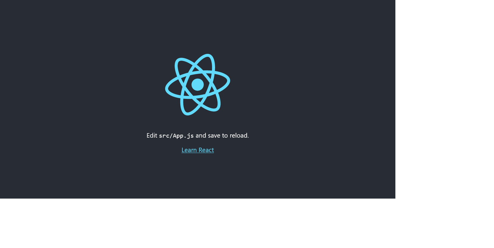
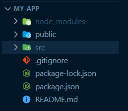
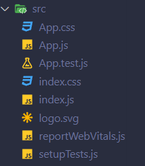
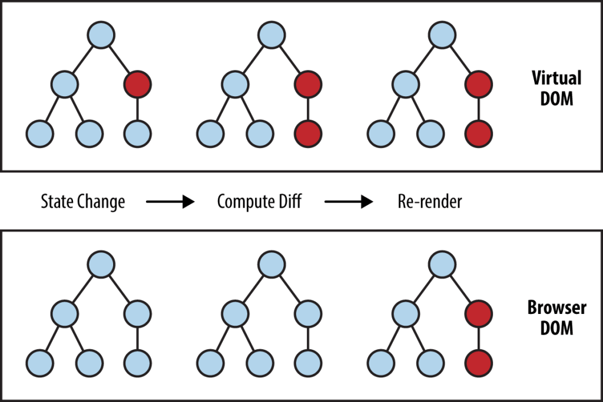

# ReactJS-learning-path
Learning-path para React basics

[React Docs](https://reactjs.org/)

### Requisitos

- HTML
- CSS
- JavaScript
- Node
- npm
- Terminal
  
## Parte 1


### Sugerencia

Ver la primer hora del curso de React de [Bob Ziroll](https://www.youtube.com/watch?v=bMknfKXIFA8)

### Inicio

#### Instalación

La forma más sencilla de crear una nueva aplicación en React es utilizando el toolchain para ambiente de desarrollo  ```create-react-app```.

> Verificar Node >= 14.0.0 y npm >= 5.6

En una nueva carpeta, utilizar la terminal para ejecutar las siguientes lineas de comando

```console
npx create-react-app my-app
cd my-app
npm start
```

Después de ejecutar, deberíamos ver algo así



#### Estructura del proyecto




- ```src``` contiene todos los archivos esenciales para nuestro proyecto
- En la carpeta public se encuentra el archivo html incial ```index.html```. Este puede ser modificado como cualquier archivo ```.html```.

1. Directorio ```src```



1. ```App.js``` es el archivo **principal** de nuestra aplicación. Todos los componentes tendrán conexión a éste archivo.
2. ```index.js``` es un archivo de inicio de la aplicación. Aquí se hace referencia al elemento html con ```id root``` para su renderización en el DOM.
3. ```App.css e index.css``` contienen estilos de la aplicación. ```index.css``` contiene estilos globales. ```App.css``` contiene estilos más especificos para componentes.


## Parte 2

### JSX

Sintáxis JavaScript XML que permite escribir elementos HTML en JavaScript, para colocarlos dentro del DOM sin la necesidad de utilizar ```document.createElement()``` o ```appendChild()```.

> Creación de elementos HTML con ```document.createElement()```

```javascript
var tag = document.createElement("p");
```

> Creación de elementos HTML con ```JSX```


```javascript
const App = () => {
    return (
        <div className="App">
            <h1>Hello World</h1>
        </div>
    )
}

export default App;
```
```export default Component``` se refiere al componente que se va a exportar de nuestro archivo ```Componente.js```. De ésta forma se envían componentes a otros archivos ```.js``` para su funcionamiento.

#### Buenas prácticas JSX

1. Todos los elementos dentro de un componente deben estar encapsulados en un solo elemento html. Puede ser ```<div>``` o el elemento React.Fragment de ```jsx```:  

```javascript
<> 
    <h2>Los demás elementos van aquí</h2>
    <div> 
        <p>Deben estar encapsulados</p>
    </div>
</> 
```

### DOM y Virtual DOM

- Real DOM
  > Lo conocemos como *Document Object Model* y representa la UI de la aplicación.
  
  > Cuando hay algún cambio, el DOM se actualiza en su totalidad.

- Virtual DOM
  > Es una representación virtual del DOM real. Similar a un DOM temporal.
  
  > Cuando se agregan/eliminan/modifican elementos, el árbol del Virtual DOM se actualiza.
  
  > Luego, se compara Virtual DOM con el Real DOM para encontrar los nodos en el árbol que han cambiado.
  
  > Cuando se encuentran las diferencias, Virtual DOM encuentra la mejor forma de actualizar nodos especificos del Real DOM sin la necesidad de actualizarlo en su totalidad.

    

## Parte 3

### React Components

Se pueden comparar con bloques de construcción de Lego. Cada componente es un bloque de piezas que representa una sección del modelo completo.

Estos componentes tienen como tarea hacer la construcción de la UI más fácil, dividiendo el problema de la app en piezas individuales que se pueden reutilizar. 

La división de los componentes generalmente ayudan a separar su estructura global en secciones que puedan funcionar de forma individual. Los componentes más comúnes son:

1. Inputs
2. Botones
3. Badge
4. Lista
5. Tabla
6. NavBar
7. Alert
8. Card
9. Tabs
10. Select

### Tipos de Componentes

#### Functional Components

Son simplemente funciones de javascript. Pueden o no recibir datos por medio de parámetros. Este tipo de componentes no toman en cuenta la existencia de otros componentes dentro de la aplicación.

```javascript
import React from 'react';

const Navbar = () => {
    return (
        <nav>
            // etc
        </nav>
    )

}

export default Navbar;
```

#### Class Components

Este tipo de componentes si están conectados con otros componentes y pueden comunicarse enviándose datos uno a otro. 

El uso de componentes funcionales es común cuando se sabe de antemano que ese componente no tendrá interactividad con otro.

```javascript
import React, { Component } from 'react';

class Navbar extends React.Component {
    render() {
        return  (
            <nav>
                // etc
            </nav>
        )
    }
}

export default Navbar;
```

### Importar componentes

Sean componentes funcionales o de clase, se pueden importar e implementar en la app de una forma muy sencilla. Para renderizarlos simplemente tenemos que importar el ```componente.js``` a el archivo de la página donde se va a renderizar, para SPAs comúnmente es ```App.js```. Para componentes que se implementarán dentro de otro componente, la sintáxis es la misma

```javascript

import Navbar from './Components/Navbar/Navbar.js';

const App = () => {
    return (
        <>
            <Navbar />
            <Carousel />
            <Main />
            <Contact />
        </>
    );
}

export default App;
```


### Component styling

Para independizar los componentes en sus propios archivos es comúnmente utilizado el aplicar estilos ```css``` por medio de clases ```className="menu navigation-menu"``` y en un archivo externo de ```.css``` colocar los estilos por ```#id``` o ```.clase```.

#### Inline style

Similar a ingresar estilos con el atributo ```style``` de html, se pueden agregar estilos para un elemento utilizando JSX.

```javascript
    const divStyle = {
        color: 'blue',
        backgroundImage: 'url(' + imgUrl + ')',
    };

    const MenuComponent = () => {
        return ( 
            <nav className="navbar" style={divStyle}>
                <a className="navbar-a">Home</a>
            </nav>
        )
    }
```
O bien, 

```javascript
// Result style: '10px'
<div style={{ height: 10 }}>
  Hello World!
</div>

// Result style: '10%'
<div style={{ height: '10%' }}>
  Hello World!
</div>
```


#### External style

Similar a importar un archivo ```styles.css``` dentro de nuestro ```index.html```, se pueden implementar archivos ```.css``` dentro de un componente. Aplicando estilos por ```class``` o ```id```.

**Navbar.js**
```javascript
import './Navbar.css';

const Navbar = () => {
    return(
        <nav className="navbar">
            <a className="navbar-a">Home</a>
        </nav>
    )
}

export default Navbar;
```
**Navbar.css**
```css
.navbar {
    display: flex;
    flex-direction: row;
    justify-content: center;
    align-items: center;
}

.navbar-a {
    font-size: 2rem;
}
```


La estructura del proyecto utilizando archivos ```.css``` externos se ve de la siguiente forma:
```
project
│   README.md
│   package.json
│   ...
│
└───src
│   │   App.js
│   │   App.js
│   │   ...
│   │
│   └───Components
│       │
│       └───Navbar
│       │       Navbar.css
│       │       Navbar.js
│       │       
│       └── ...
```

## Parte 4

### Props

```Props``` se refiere a propiedades. Argumentos de objetos con datos que le envíamos al componente para aplicarlo dentro de su lógica.

Se utiliza props para aumentar significativamente la reusabilidad de los componentes en una aplicación, transformando la información que se comparte en información dinámica, y/o utilizando estos datos para modificar el componente.

### Props sin desestructuración

Podemos utilizar props dentro de un componente de la misma forma en la que aceptamos argumentos en una función.

**Header.js**
```javascript
import React from 'react';
const Header = (props) => {

    const name = props.name;
    const lastName = props.lastName;
    
    return (
        <div>
            <h1>Hola, {name}, {lastName}</h1>
        </div>
    )
}

export default Header;
```

Para enviar datos hacia ese componente, lo hacemos de la misma forma como utilizamos atributos dentro de una etiqueta ```html```.

**App.js**
```javascript
import Navbar from './Components/Navbar/Navbar.js';
//etc...

const App = () => {
    return (
        <>
            <Navbar />
            <Header name="Griselo" lastName="Philip">
            <Carousel />
            <Main />
            <Contact />
        </>
    );
}

export default App;

```

### Props con desestructuración

A diferencia del método anterior, podemos declarar cada prop individual desde que los tomamos como parámetros en nuestro componente. 

```App.js``` se mantiene igual

**Header.js**
```javascript
import React from 'react';
const Header = ({name, lastName}) => {
    
    return (
        <div>
            <h1>Hola, {name}, {lastName}</h1>
        </div>
    )
}

export default Header;
```

### Default props

Para evitar confusión y mejorar UX, es común utilizar default props como valores predeterminados que serán utilizados en caso de que los parámetros fallen, o no se haga el fetch de manera correcta.

Estos default props se crean directamente en el componente 

**Header.js**
```javascript
import React from 'react';
const Header = (name, lastName) => {
    
    return (
        <div>
            <h1>Hola, {name}, {lastName}</h1>
        </div>
    )
}


// Aqui declaramos default Props
Header.defaultProps = {
    name: "Nombre",
    lastName: "Apellido"
}

export default Header;
```


### Props + spread

Javascript tiene el operador spread, que es de gran utilidad al momento de enviar muchos datos a un componente, sin la necesidad de especificar cada uno como atributo dentro de la etiqueta del componente.


**App.js**
```javascript
import Navbar from './Components/Navbar/Navbar.js';
//etc...

const App = () => {
    // Definir los datos
    const user = {
        name: "Griselo",
        lastName: "Philip"
    };


    return (
        <>
            <Navbar />
            // Se envian los datos
            <Header {...user}>
            <Carousel />
            <Main />
            <Contact />
        </>
    );
}

export default App;

```


### Renderizado condicional con Props

Renderizado condicional es la forma en que React permite mostrar ciertos datos en la interfaz cuando se cumplan ciertas condiciones lógicas.

Se pueden utilizar de forma condicionales 

```if - else ``` 

``` condition && ```

o, más comúnmente, con el operador ternario 

```condition ? exprIfTrue : exprIfFalse ```

> Condition: expresión lógica a evaluar

> exprIfTrue: Lógica a ejecutar si es verdadero

> exprIfFalse: Lógica a ejecutar si es falso


**If - else**
```javascript
// Renderizado de icono de perfil, si esta iniciada la sesión
// Renderizado de Boton si no
const Navbar = (props) => {
    return (
        <nav>
            <div clasName="logo"> 
                // code here
            </div>
            {
                if(props.isLogged) {
                    return(<UserIcon />)
                } else {
                    return (<LoginButton />)
                }
            }
        </nav>
    )
}

export default Navbar;

```

**Ternary**
```javascript
// Misma lógica al ejemplo anterior
const Navbar = (props) => {
    return (
        <nav>
            <div clasName="logo"> 
                // code here
            </div>
            { 
                props.isLogged ? (<UserIcon />) : (<LoginButton />)
            }
        </nav>
    )
}

export default Navbar;

```

**&&**
```javascript
// Misma lógica al ejemplo anterior
const Navbar = (props) => {
    return (
        <nav>
            <div clasName="logo"> 
                // code here
            </div>
            {
                props.isLogged && <UserIcon />
            }
        </nav>
    )
}

export default Navbar;

```

## Parte 5

### Material UI

[Material UI](https://mui.com/) es una librería open-source para React que hace uso e implementa el diseño [Diseño material de Google](https://material.io/).

#### Instalación

Se instala en nuestro proyecto por medio de npm o yarn.

> npm

```console
npm install @mui/material @emotion/react @emotion/styled
```

> Yarn
```console
yarn add @mui/material @emotion/react @emotion/styled
```

> Emotion es una librería que permite utilizar y diseñar CSS dentro de javascript. Se puede sustituir por la libreria de styled-components, de la siguiente forma:

```console
npm install @mui/material @mui/styled-engine-sc styled-components
```
```console
yarn add @mui/material @mui/styled-engine-sc styled-components
```

**nota**
- @mui/material no contiene iconos. Para agregar a nuestro proyecto lo podemos hacer mediante npm

- Para instalar fuentes, se puede hacer por medio de CDN, o vía NPM siguiendo las instrucciones de google fonts.

```console
npm install @mui/icons-material
```
```console
yarn add @mui/icons-material
```

### Material UI - Componentes

1. Layout
 - [Container](https://mui.com/material-ui/react-container/)
 - [Grid](https://mui.com/material-ui/react-grid/)
 - [Stack](https://mui.com/material-ui/react-stack/)

2. Display
 - [App bar](https://mui.com/material-ui/react-app-bar/)
 - [Card](https://mui.com/material-ui/react-card/)


## Otros recursos
> - [Eve Porcello - React Essential Training](https://www.linkedin.com/learning/react-js-essential-training-14836121?u=100575394)
> - [Estefania Cassigena - React desde cero](https://www.freecodecamp.org/espanol/news/aprende-react-desde-cero-curso-de-react-con-proyectos/)
> - [Joel Olawanle - Getting started React](https://www.freecodecamp.org/news/get-started-with-react-for-beginners/)
> - [Jean-Marc Mockel - React Best Practices](https://www.freecodecamp.org/news/best-practices-for-react/)
> - [Ihechikara Vincent Abba - React Router v6](https://www.freecodecamp.org/news/how-to-use-react-router-version-6/)
> - [Reed Barger - React Router Cheatsheet](https://www.freecodecamp.org/news/react-router-cheatsheet/ )
> - [Understanding Functional Components vs Class Components](https://www.twilio.com/blog/react-choose-functional-components)